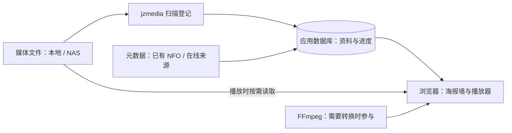
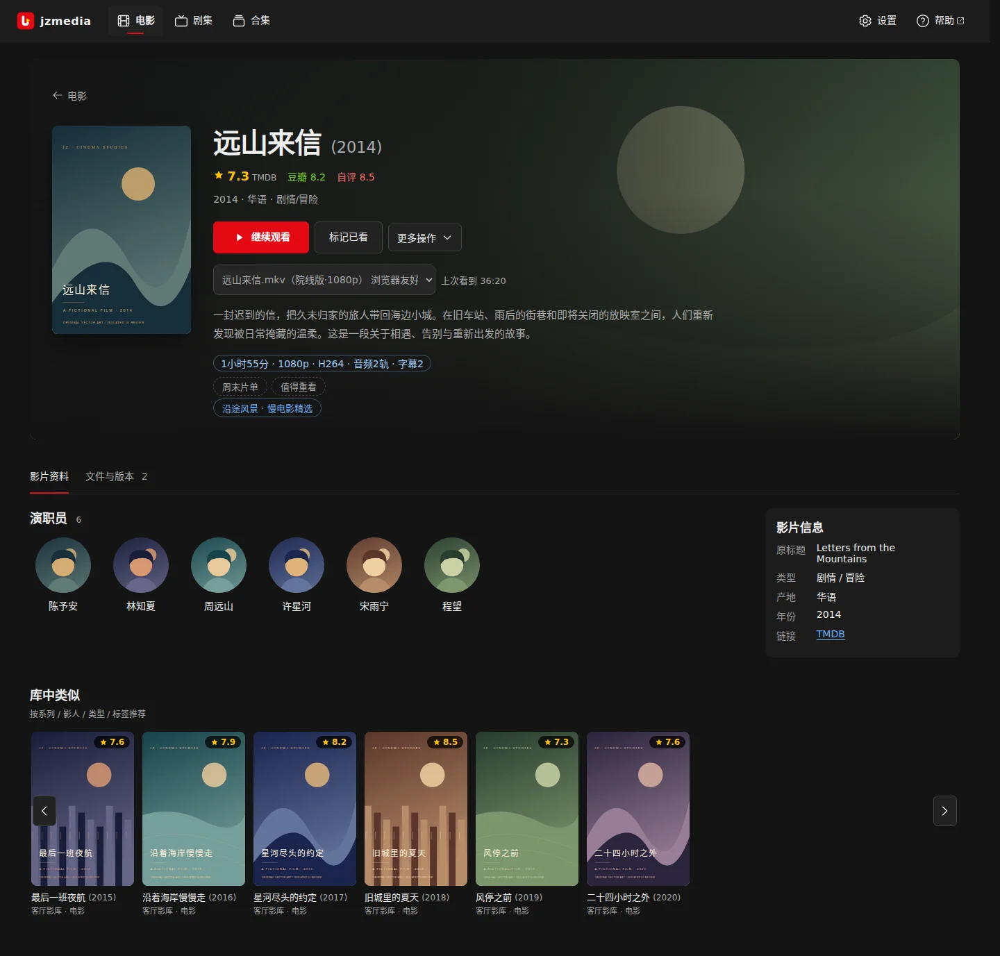
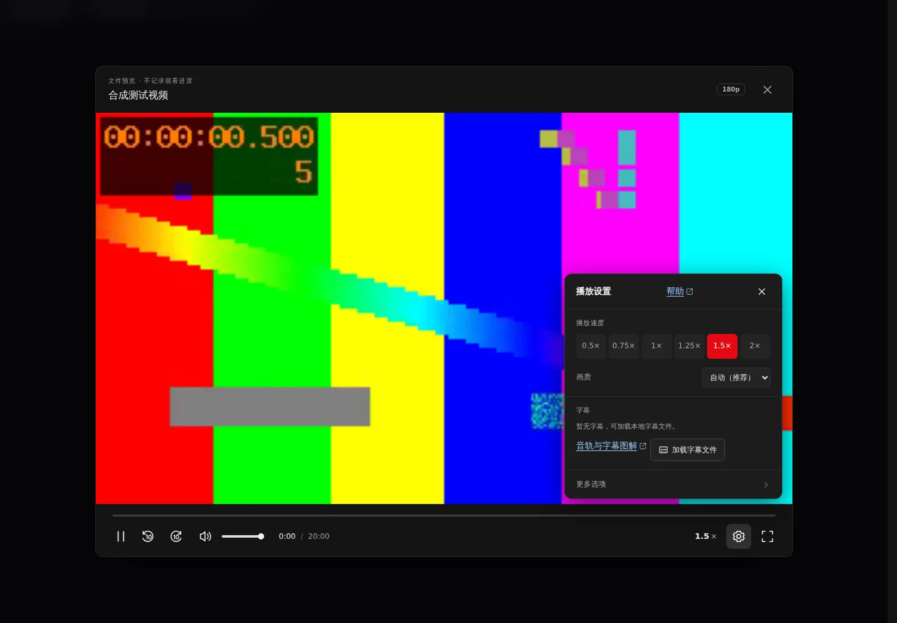

# jzmedia

把本地硬盘或 NAS 里已有的电影、剧集整理成可在浏览器里找片、看片的私人影视库。


*电影海报墙：顶栏按媒体库切换，继续观看保留上次进度，下方海报默认按入库时间排列。*

## 能做什么

- **找片**：海报墙、搜索与多维筛选、电影详情、人物作品页与合集，从已有收藏里定位想看的片。
- **入库**：扫描目录登记文件，自动匹配标题年份；未匹配与待确认进核对清单，手动绑定纠错；支持已有 NFO 离线导入与 TMDB 等在线来源。
- **追剧与多版本**：同一部电影的多个文件按版本保留，各存断点；剧集按剧→季→集组织，继续观看与自动连播，同集多版本互不串集。
- **整理目录**：改名前先看原路径→目标路径预览，确认后才移动或改名；电影可恢复到原始位置，剧集整理有审计历史与撤销。
- **浏览器播放**：按片源与浏览器能力选择原文件直发、重新封装或转码；画质、音轨、字幕、倍速与进度缩略图在播放器里调整。
- **本地与 NAS**：本地目录、SMB 直读或挂载、NFS 挂载；一个媒体库保存存储连接，下面再分电影库、剧集库。

## 怎样工作



媒体文件始终留在你配置的存储里，扫描只登记文件信息和资料，数据库并不装入整部影片。元数据可以来自媒体旁已有的 NFO、应用缓存，或配置好的在线来源；在线来源需要网络与凭据，离线时只能用已有 NFO 与缓存。浏览器打开 Vue 界面，FastAPI 提供 API 与媒体访问，SQLite 保存资料、匹配关系与观看进度。播放时按片源格式和浏览器能力决定原文件直发、重新封装或转码，只有需要转换的路径才经过 FFmpeg。扫描、匹配、资料写回、目录整理是各自独立的操作：扫描登记不等于同意改名，整理必须经过预览和确认。

## 快速开始

需要 Docker Compose。以下命令在项目根目录执行：

```bash
cp .env.example .env
mkdir -p media data
docker compose -f docker-compose.yml up --build -d
```

把 `.env` 里的 `UID`/`GID` 改成当前用户（`id -u` / `id -g`），并确认该用户可读写数据目录、可读取媒体目录。已有 `.env` 时不要重复覆盖。始终显式指定 `-f docker-compose.yml`，避免载入本机开发用的 `docker-compose.override.yml`。

打开 `http://localhost:8080`，先看 `/api/health` 确认服务正常，再到「设置 → 媒体库连接」建库、「设置 → 扫描与整理」扫描并核对，最后打开一部影片试播。NAS 部署、宿主直接运行、硬件转码与完整首次入库流程见[部署教程](docs/getting-started/deployment.md)。

## 文档

| 你要做什么 | 去哪里 |
|---|---|
| 安装、配置、备份升级、启动排障 | [入门与部署](docs/getting-started/README.md) |
| 建库、找片、匹配、整理、播放等日常操作 | [用户手册](docs/user-guide/README.md) |
| 架构、模块、数据模型、存储、播放实现 | [开发者文档](docs/developer/README.md) |
| 待办事项与人工验收清单 | [开发计划](docs/roadmap/README.md) |

常查专题：[播放器](docs/user-guide/player.md) · [剧集目录归属与整理](docs/user-guide/tv.md) · [扫描与元数据](docs/user-guide/metadata.md) · [配置参考](docs/getting-started/configuration.md) · [播放实现](docs/developer/playback.md)。


*电影详情：背景与海报来自资料来源，多版本在“文件与版本”中选择后播放。*


*剧集：按剧→季→集组织，断点与连播沿当前版本推进。*


*播放器：画质、音轨、字幕、倍速在底部齿轮中调整，“播放信息”显示实际输出方式。*

## 运行边界与参与方式

目标是家庭或受信任网络中的单实例部署。可选令牌只保护 `/api` 下的写操作，浏览、播放与媒体直链仍开放；它不是多用户登录或完整权限系统。媒体内容由使用者自行提供，转码能力取决于片源、CPU/GPU 与网络。

仓库当前没有 `LICENSE` 文件，对外发布前由维护者确定；没有公开镜像仓库、下载站或问题追踪平台。开发约束见 [AGENTS.md](AGENTS.md)，改代码前先读[开发者文档](docs/developer/README.md)。文档基线（版本、schema、核对日期）集中维护在[文档导航](docs/README.md)。

[完整文档导航](docs/README.md)
