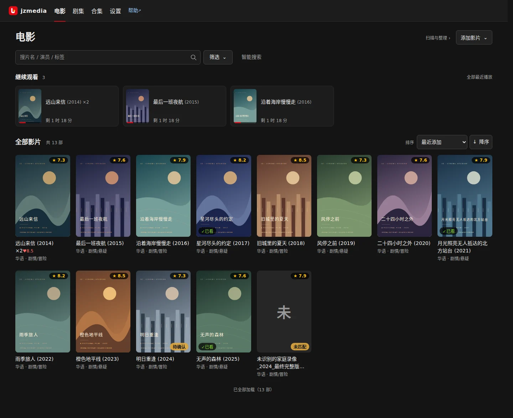

# jzmedia

把本地硬盘或 NAS 里已有的电影、剧集，变成可以在浏览器里找片、看片的私人影视库。

支持电影与剧集、多版本、合集、资料匹配、字幕、倍速和浏览器播放。连接本地目录或 NAS，扫描后核对资料，即可开始观看；整理目录需单独预览和确认。影片由使用者自行提供，不提供下载源。

## 快速开始

从 [GitHub Releases](https://github.com/nojobnopay/jzmedia/releases) 下载源码归档、Linux amd64 Docker 镜像归档或可安装的 Android TV Debug APK。

跟随[安装教程](docs/getting-started/deployment.md)部署。服务启动后访问 `http://服务器地址:8080`，点击空库欢迎卡片“开始配置”，按[首次入库图解](docs/user-guide/onboarding.md)完成配置和试播。

已运行的实例在 `/help/` 提供图文帮助，API 调试文档位于 `/docs`。帮助站点可离线随应用使用；仓库中正文与图表源仍可直接阅读。

## 文档

| 当前任务 | 入口 |
|---|---|
| 图文教程与任务导航 | [帮助首页](docs/index.md) · [完整任务目录](docs/user-guide/README.md) |
| 安装、配置、升级与备份 | [部署与维护](docs/getting-started/README.md) |
| 系统架构、API 与开发 | [开发者参考](docs/developer/README.md) |
| 同步构建 Docker 镜像与 APK | [统一发布](docs/developer/releasing.md) |
| 制作文档、截图与演示 | [文档制作与发布](docs/developer/documentation.md) |
| 开发计划与待验收 | 仓库 `docs/roadmap/`（不随公开帮助发布） |

安卓电视客户端位于独立工程 [android-tv/](android-tv/README.md)，日常可单独构建，发行时与 Docker 镜像从同一提交同步构建并共用版本。已接入连接、媒体浏览和原生播放，当前为待验收的开发版本，默认交付 Debug 试装 APK；红米真机及正式签名升级尚未验收，范围见 [电视端开发计划](docs/roadmap/android-tv.md)。

## 仓库目录

| 目录 | 维护内容 |
|---|---|
| `app/`、`tests/` | FastAPI 服务、SQLite 存储及后端回归测试 |
| `frontend/` | Vue 应用、前端单元测试与构建配置 |
| [android-tv/](android-tv/README.md) | 独立 Android TV 工程、客户端文档与验证工具 |
| [design/](design/README.md) | 跨端图标和品牌母版、语义令牌、资源清单及验收记录 |
| [docs/](docs/README.md) | 帮助站正文、教程素材、站点工具和测试；素材规则见 [docs/assets/](docs/assets/README.md) |
| [docs/roadmap/](docs/roadmap/README.md) | 开发计划、完成状态与待验收事项，不随公开帮助发布 |
| [scripts/](scripts/README.md) | 构建、文档制作、隔离冒烟与诊断工具 |
| `data/`、`media/`、`output/` | 本机运行数据、用户媒体与验证产物，Git 忽略；私有操作记录放 `docs/private/` |

新增文件按用途归入上述目录。教程图片和录屏连同来源清单保存在 `docs/assets/`；跨端设计产物由 `scripts/build_design.py` 生成并提交。构建目录、缓存和临时验证输出不提交；已有验收证据不因可以重新生成就直接清除。

完成的一次性修复脚本从工作树删除，通过 Git 历史追溯。阶段性实施与测试总结写入提交或 PR 说明；长期有效的约束维护在对应技术文档，素材来源维护在素材清单。

## 运行边界与参与方式

面向家庭或受信任网络中的单实例部署。可选令牌保护 API 的 POST、PUT、PATCH、DELETE 请求，包括网页播放的启动和进度保存；浏览列表及媒体直链仍开放。它不是多用户登录与完整权限系统。转码能力取决于片源、CPU/GPU 和网络。

项目仓库位于 [GitHub：nojobnopay/jzmedia](https://github.com/nojobnopay/jzmedia)。修改代码前阅读仓库 [AGENTS.md](AGENTS.md) 和开发者参考。运行数据、媒体、凭据与 `docs/private/` 不进入文档发布包。

## 许可证

本项目采用 [BSD 3-Clause License](LICENSE)，版权归 joey.zhou 所有。第三方组件和素材保留各自的许可证与来源说明，设计素材见 [design/README.md](design/README.md)。
