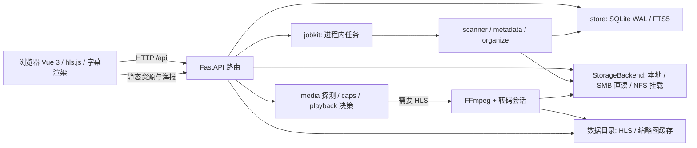

# 系统架构

[开发者文档](README.md)

jzmedia 使用单进程 FastAPI 服务，提供 Vue 网页和独立 Android TV 客户端共享的 API。服务同源托管 Vue 构建结果、海报、`/help/` 帮助站和 `/api`；SQLite 保存库、元数据、任务相关持久记录及播放进度；媒体文件位于本地或远程存储。耗时扫描、整理和预览生成通过后台任务推进；媒体播放按客户端能力直发或调用 FFmpeg。下图展示网页请求路径。

## 请求路径

### 浏览页面

端到端以一次海报墙访问为例：浏览器 `GET /` 拿到 SPA → `GET /api/movies?media_library=2` 读库 → `store` 查询 → JSON 返回影片列表 → 图片走 `/posters/...` 静态。关键词搜索使用搜索接口，继续观看另取最近播放接口。详情、人物、合集同理，只是换路由与查询；筛选条件在 SQL 层按“维度内 OR、维度间 AND”拼装（标签多选除外）。

### 扫描与维护任务

扫描入库另走后台：`POST /api/jobs/scan` 建任务后返回 `job_id`，`scanner` 线程经 `StorageBackend.iter_tree` 遍历 → 分类/匹配/持久化 → `scan_state` 记增量；前端轮询 `GET /api/jobs/scan` 或具体 job ID 看进度。目录整理先预览再确认；重建 NFO 与缩略图按各自任务接口显式启动，不能假定每个任务都带相同的预览协议。取消是协作式，已经完成的操作保留。

### 网页播放

1. 浏览器通过 `caps.js` 检测格式/显示能力，经 `POST /api/stream/{id}/decide` 上报候选能力。
2. FastAPI 从 `store` 找对应电影、集或花絮，使用 `StorageBackend` 生成可读媒体源；`media.py` 对必要源做 ffprobe 探测，结果存 `media_info`。
3. `playback.plan` 给出 direct/remux/audio_transcode/video_transcode 决策；直发走支持 Range 的 blob，其他路径建 HLS 会话。浏览器 hls.js 或原生 HLS 消费结果。
4. 页面状态与进度仍通过 API 写库；播放缓存、缩略图属于服务数据目录，可重新生成。

### 电视播放

Android TV 先通过 `/api/stream/client-info` 握手，再显式上传 `client=android_tv` 及设备能力，使用同一播放计划、进度和媒体存储。每个播放请求获得独立 sid，相同源和输出计划可共享一个 FFmpeg 任务；释放某设备 sid 只释放其持有关系。APK 日常可独立构建，发行与 Docker 镜像共用版本及源码提交，见[统一发布](releasing.md)；客户端协议见仓库 `android-tv/docs/protocol.md`。

## 启动与退出

`app/main.py` 在 lifespan 中创建目录、执行迁移、迁移旧海报目录、探测转码后端、启动远程挂载看门狗，并在退出时清理预览任务、播放会话和挂载。模块导入不应触发文件操作。外部接口通过各 router 注册；生产构建的 `frontend/dist` 挂载为 SPA。

`jobkit`、活动 HLS session、转码后端探测缓存和部分锁都在进程内，因此**必须单 worker**。加多个 `uvicorn --workers` 会让请求命中不同进程，出现查不到会话或任务的现象。若未来改成多实例，需先重设计任务、缓存锁及会话状态共享，不是只修改部署参数。

## 读写边界

- `app/config.py` 读取环境变量；部分键由 SQLite 中非空设置覆盖。Docker Compose 的宿主媒体路径只用于挂载，业务代码使用 `settings.media_root`、`settings.data_dir` 和库表路径。
- `store` 负责持久资料和版本迁移，不在路由里散写 SQL。路径操作走 `storage` 与 `library_paths`，保护视频库边界。
- 写 API 可选令牌鉴权；GET、海报与媒体直链不受该令牌保护，网页播放器的 POST 决策、会话和进度请求则需要令牌。这是设计边界，不能把它当成私有文件授权系统。
- 日志经 `app/log.py`，新失败路径要记录上下文，不能静默吞异常。

部署视角见 [安装教程](../getting-started/deployment.md)；改代码前从 [模块划分](modules.md) 找归属。
