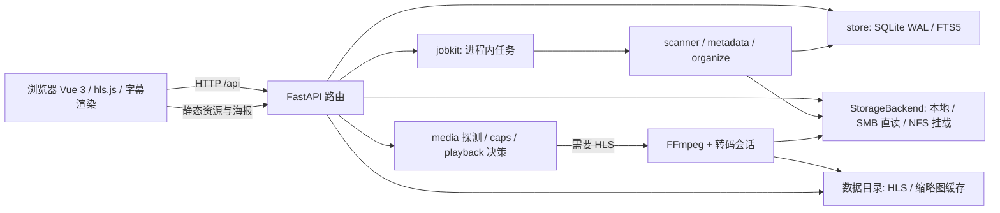

# 系统架构

[开发者文档](README.md)

jzmedia 是单实例 Web 应用。FastAPI 同源托管 Vue 构建结果、海报和 `/api`；SQLite 保存库、元数据、任务相关持久记录及播放进度；媒体文件位于本地或远程存储。耗时扫描、整理和预览生成通过后台任务推进；媒体播放按浏览器能力直发或调用 FFmpeg。

## 请求路径

1. 浏览器通过 `caps.js` 检测格式/显示能力，经 `POST /api/stream/{id}/decide` 上报候选能力。
2. FastAPI 从 `store` 找对应电影、集或花絮，使用 `StorageBackend` 生成可读媒体源；`media.py` 对必要源做 ffprobe 探测，结果存 `media_info`。
3. `playback.plan` 给出 direct/remux/audio_transcode/video_transcode 决策；直发走支持 Range 的 blob，其他路径建 HLS 会话。浏览器 hls.js 或原生 HLS 消费结果。
4. 页面状态与进度仍通过 API 写库；播放缓存、缩略图属于服务数据目录，可重新生成。

## 启动与退出

`app/main.py` 在 lifespan 中创建目录、执行迁移、迁移旧海报目录、探测转码后端、启动远程挂载看门狗，并在退出时清理预览任务、播放会话和挂载。模块导入不应触发文件操作。外部接口通过各 router 注册；生产构建的 `frontend/dist` 挂载为 SPA。

`jobkit`、活动 HLS session、转码后端探测缓存和部分锁都在进程内，因此**必须单 worker**。加多个 `uvicorn --workers` 会让请求命中不同进程，出现查不到会话或任务的现象。若未来改成多实例，需先重设计任务、缓存锁及会话状态共享，不是只修改部署参数。

## 读写边界

- `app/config.py` 读取环境变量；部分键由 SQLite 中非空设置覆盖。Docker Compose 的宿主媒体路径只用于挂载，业务代码使用 `settings.media_root`、`settings.data_dir` 和库表路径。
- `store` 负责持久资料和版本迁移，不在路由里散写 SQL。路径操作走 `storage` 与 `library_paths`，保护视频库边界。
- 写 API 可选令牌鉴权；GET、海报与媒体直链不受该令牌保护。这是设计边界，不能把它当成私有文件授权系统。
- 日志经 `app/log.py`，新失败路径要记录上下文，不能静默吞异常。

部署视角见 [安装教程](../getting-started/deployment.md)；改代码前从 [模块划分](modules.md) 找归属。
