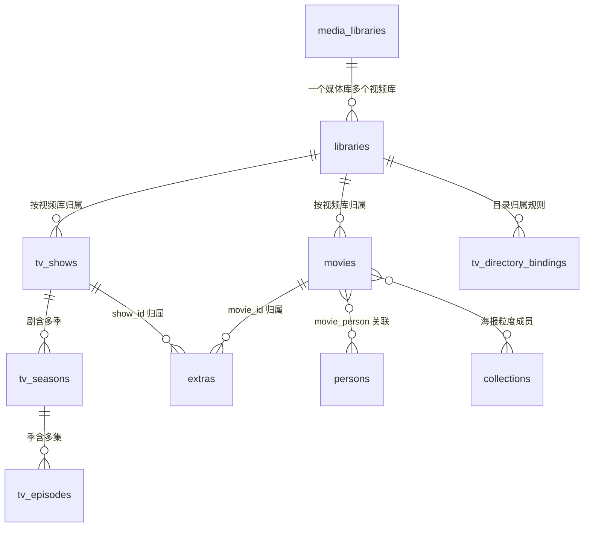

# 数据模型与迁移

[开发者文档](README.md)

数据源在 `app/store/_base.py`，使用 Python 标准库 `sqlite3`，不使用 ORM。当前 `SCHEMA_VERSION=28`；启动 `init_db()` 检查 SQLite JSON1/FTS5、建表、按 `PRAGMA user_version` 执行幂等迁移，再视需要重建索引。连接启用 WAL、`busy_timeout=5000` 和 `synchronous=NORMAL`。

## 主要实体

外键只表达归属方向；`media_info`、`playback_progress` 按 `(kind, item_id)` 键隔离电影/分集/花絮，不做硬外键。`tmdb_cache` 主键是 `(media_type, tmdb_id)`，电影与剧集的数值 id 空间独立。合集成员按海报粒度（同 `tmdb_id` 全版本）归并，不是按单个文件行。

| 表 | 作用/关键关联 |
|---|---|
| `media_libraries` | 存储连接/根目录、凭据、只读、健康状态；一个媒体库有多个视频库 |
| `libraries` | 视频库类型 `movie/tv`、`media_library_id`、子路径、命名档、落盘策略及来源链 |
| `movies` | 文件版本行，`UNIQUE(library_id,file_path)`；同片多个文件经匹配关系归并展示 |
| `tv_shows` / `tv_seasons` / `tv_episodes` | 剧、季、集镜像；分集含本地匹配/观看等字段，另有 `match_source`（归属来源）与 `binding_conflict`（归属冲突标记） |
| `tv_directory_bindings` | 目录归属规则：主键 `(library_id, path)` → `(show_id, season, override_season)`；扫描与重扫沿用，整理/恢复同步改写路径 |
| `extras` | 电影/剧集花絮，分别通过 `movie_id`/`show_id` 归属 |
| `media_info` | 按 `(kind,item_id)` 缓存 ffprobe 结果与 `probe_ver` |
| `playback_progress` | 按 `(kind,item_id)` 隔离电影、分集、花絮续播 |
| `scan_state` | 文件大小/mtime/扫描状态，用于增量与整理后的路径同步 |
| `tv_binding_history` | 归属变更的预览/执行快照与撤销状态机（`preview` → 已执行/已撤销），预览 token 15 分钟有效 |
| `organize_moves` | 剧集整理逐步审计：批次、源/目标、文件或目录、撤销时间 |
| `tmdb_cache`、`external_meta`、`match_index` | 已获取的来源详情和可离线检索索引 |
| `persons`、`movie_person`、`collections`、`collection_members` | 演职员关联和媒体库级合集 |
| `app_settings` | 数据库优先的运行配置及来源冷却状态 |

## FTS 与字段所有权

`movies_fts` 是 FTS5 索引，**没有 SQL trigger**。修改 `movies`、`persons`、`movie_person` 相关可检索字段后需调用 `store.resync_fts(movie_id)`；直接手写 SQL 若漏同步会使搜索与详情不一致。启动在迁移或检测到不一致时重建 FTS；设置页也提供手动重建。搜索对中文分词不足的场景可能走 LIKE 回退，大库要留意性能。

`TMDB_FIELDS` 与 `LOCAL_FIELDS` 在 `store/_base.py` 分列，来源缓存和本地自有字段不能随意混写。`movies.title_auto` 标明标题能否被更可信来源自动覆盖；`added_at` 是首次入库时间，不应在重扫时刷新。`overview_override` 与观看/评分/标签是本地资料，刷新来源时须保护。

## 安全迁移步骤

1. 在 `_base.py` 增加新 schema 列/表及对应迁移步骤；确保旧库可顺序升级，新库直接建全量 schema。
2. 为已有数据提供回填和默认值，迁移过程可重复运行而不破坏数据。
3. 添加空库、旧版本升级和重复初始化测试；注意 `scan_state`/FTS 及外部索引关联。
4. 不在模块导入期 `init_db()`；仅启动 lifespan 或显式测试初始化。
5. 升级前备份数据目录及远程凭据密钥；旧程序未必能直接打开新 schema。

库路径变动要同步数据库和扫描状态，不能只移动磁盘文件。现有整理/恢复提供审计路径；具体约束见 [存储设计](storage.md)。
