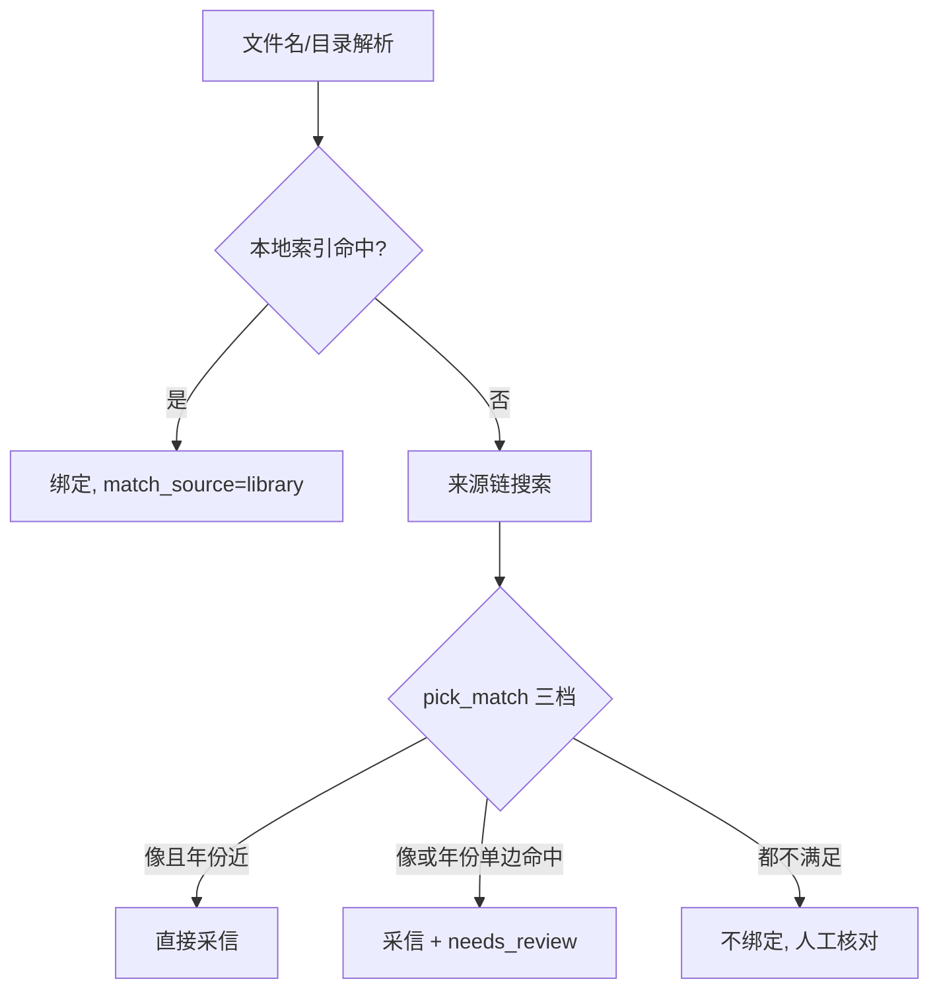

# 扫描与元数据设计

[开发者文档](README.md)

## 扫描管线

`app/scanner/scan.py` 从 `StorageBackend.iter_tree` 遍历，尽量复用目录遍历同时取得的 size/mtime。`classify.py` 根据路径、扩展名、样片/花絮/字幕目录规则分流：电影经 `parse.py`、`match.py`、`persist.py` 入 `movies`；剧集走 `tv_parse.py`、`tv_match.py`、`tv_persist.py` 落 `tv_shows`/`tv_seasons`/`tv_episodes`，并行登记花絮/剧场版到 `extras`。`scan_state` 记录处理状态支持增量；force 才重试部分已缓存路径。显式缺失清理应先确认库在线。

电影匹配要核对文件名相似度、年份容差和短标题风险，不能直接选搜索结果第一项。

剧集侧在阶段间共享数据：`tv_parse.py` 的阶梯规则输出 (season, episode)、区间与绝对编号；`tv_match.py` 绑定整剧条目（相似度门 + 热度消歧 + 别名兜底）；`tv_persist.py` 把详情写入剧/季/集镜像，分集绑定按"精确 (季,集) → TMDB 跨季连续编号 → 本地季拼接/绝对号"三档回退，落不进 TMDB 的行标 `needs_review` 而不是猜测。已刮元数据不会被重扫覆盖；强制重刮是显式操作。

普通案例：`告白.Confessions.2010.mkv` 先被本地库已匹配的《告白/54186》命中，零网络绑定。歧义案例：短标题或重名作品（如年份不符但标题像）只采信并标待确认，或完全不绑定等人工核对；换绑时用新缓存标题覆盖旧错配标题（`force_title`），避免 id 改了标题没改。

用户在详情的手工绑定、确认或本地确认集属于独立操作，不能因再次扫描无条件覆盖。

## 来源链与缓存

`app/metadata/chain.py` 默认 local → tmdb → wikidata，视频库的 `metadata_providers` 可覆盖顺序；已实现 TVmaze、Bangumi 和可选 Douban 候选。`auto.py` 为外源自动绑定设相似度/年份门，低置信候选仍给人工审阅。`state.py` 将连续失败 3 次后的 10 分钟冷却保存在 `app_settings`，空结果不算失败。

`tmdb_cache` 和 `external_meta` 保留已获得的详情，`match_index`/FTS 用于离线检索；本地 NFO 可导入字段及图片。IMDb 数据集导入补离线索引，不等于全文详情源。新增 provider 时同时处理候选、详情、来源名、速率/失败、持久化和手动绑定 UI；不能只把名字塞进下拉框。

## NFO 与图片落盘

`app/nfo.py` 构造 Kodi/Plex 可消费的资料；`scanner/nfo_link.py`、`tv_nfo_link.py` 决定写入位置，`artwork.py` 按视频库 `artwork_mode` 写媒体目录图片。电影是否每版本写 NFO/海报由 `library_paths.per_version_meta` 统一判断：默认只有 Plex 命名档且版本 edition 不同才分版本；共享混放目录避免让不同片共用 `movie.nfo`。剧集有 `tvshow.nfo`、季 NFO、可选逐集 NFO；远程逐集写入默认保守。

数据目录的海报路径由 `app/posters.py` 统一生成，数据库存相对路径，前端不得把功能子目录截掉。NFO/海报落盘必须尊重只读、用户修改及内容哈希/归属规则。匹配成功、刷新和重建任务都可能触发写盘，变更时需同时测试本地和 SMB 后端。

## 一条新规则如何落地

先在分类/解析/匹配纯函数中表达规则，加覆盖歧义和误匹配的样例；再验证扫描结果、缓存索引和待确认标记，最后接入落盘及 API。任何会改文件的整理规则须另走预览与审计，不能隐含在普通扫描里。[数据模型](data.md)。
