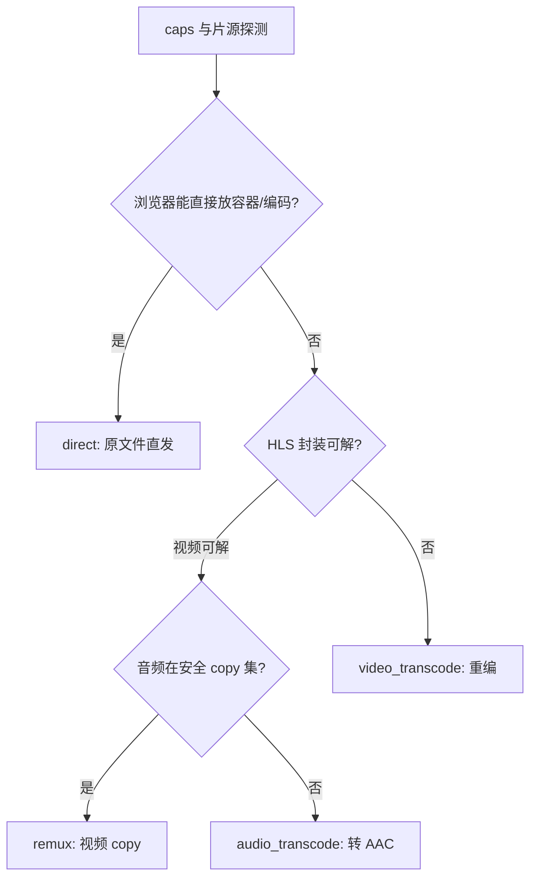

# 播放核心设计

[开发者文档](README.md)

## 从能力到播放计划

`app/media.py` 用 ffprobe 得到容器、编码、帧率、音字幕轨、HDR/DV 等，结果在 `media_info` 按 `(kind,item_id)` 缓存；当前 `PROBE_VERSION=4`，探测版本落后时在播放前重新探测。前端 `caps.js` 检测浏览器格式能力，`POST /api/stream/{id}/decide` 上传 caps；不带 caps 的 GET 兼容口使用保守默认。`app/caps.py` 规范/哈希能力，`app/playback/plan.py` 决定：

| 方式 | 视频 | 音频 | 典型原因 |
|---|---|---|---|
| `direct` | 原文件直发 | 原文件默认轨 | 容器、编码及轨道均可浏览器直放 |
| `remux` | copy | copy | 内容可解，但容器/选轨需改为 HLS |
| `audio_transcode` | copy | 转 AAC | 视频可解，音频不在安全 copy 集合 |
| `video_transcode` | 重编 | 按需 copy/重编 | 视频编码、尺寸或 HDR 路径不适合直通 |

画质 `auto/source/1080p/720p` 会影响输出尺寸和会话复用；`auto` 只在需要视频重编且源高度超过 1080 时封顶为硬件 1080p、软件 720p，copy 路径保留原尺寸。`source`（原画）取消自动封顶，格式不兼容仍需转换，不能保证免重编；旧 `original` 按 `auto` 兼容。切换画质可能重开会话，不属于无缝 ABR。网页对 HDR10/HLG、带 HDR10 基底的 DV P8.1，在客户端可解 PQ 时允许直通；DV P5 无兼容基底阻止直通。硬件后端可 tone map，软件退化路径会给原因提示。

数值例子：某片从 125.5 秒续播，目标前最近关键帧在 124.0 秒。copy 会话返回 `media_start=124.0`、`initial_time=1.5`：播放器片内 0 对应原片 124.0 秒，起播落在片内 1.5 秒处。字幕 cue 存的是原片时间，逐帧用 `media_start + 片内时间` 判定是否显示，再叠加用户设置的延迟。

## HLS 与 FFmpeg

`playback/cmd.py` 组命令，`transcode.py` 检测 VAAPI → QSV → NVENC → 软件，首轮硬件 45 秒仍不出片时软件重试。默认 fMP4 HLS，每片目标 4 秒，`HLS_SEGMENT_TYPE=ts` 回退目标 6 秒的旧 TS。fMP4 单 FFmpeg 进程产生视频和最多 8 条音轨 rendition；服务端写 `master.m3u8`，`CODECS` 包含整个音频组的实际输出编码并集。ffmpeg 继续增长的 `out_*.m3u8` 应按内容快照返回，不能直接用按旧长度计算 Content-Length 的 `FileResponse`。FFmpeg 工作目录必须是产物目录，因为分片输出文件名是相对路径。

fMP4 HLS 音轨通过 rendition 切换，一般不重开会话；网页原文件直发只能播放默认轨，非原生 HLS 浏览器选择其他轨时转为 remux。hls.js 音频 copy 默认仅 AAC/MP3，EAC3/AC3 转 AAC；Safari 原生 HLS 可支持更多 Dolby 格式。Android TV 则根据声明的原生选轨能力判断。`AUDIO_COPY_SAFE` 只应在目标设备实测后放宽。

音轨切换在 hls.js `MANIFEST_PARSED` 和 `AUDIO_TRACKS_UPDATED` 后应用，前者触发时列表可能尚空。源轨 default 与用户 UI 选择分离，非烧录字幕切换不应让音视频重新编码。copy 首屏等一个视频分片，视频重编/烧录等两个，不能把音频片计入视频可播放判断。

## 会话时间轴与清理

`POST /sessions` 返回源时间轴起点 `media_start` 和会话内起播位置 `initial_time`。copy 会话起点可落在目标前关键帧；客户端进度和字幕必须把片内时间换回原片时间。先在缓冲或 seekable 范围复用；范围外重开会话；完整的 start=0 成品可被续播命中。

### 客户端会话与共享产物

每次成功创建都返回新的客户端 sid；服务端 `_sessions` 保存各客户端持有关系，`_tasks` 在锁内按 `(kind,id,完整产物键)` 共享 FFmpeg 任务。完整键包含源路径/size/mtime、实际输出 plan、封装、烧录字幕及精确起点，目录名带 SHA-256；同一 fMP4 的所选音轨、非烧录字幕和仅名称不同的同输出画质不会拆出重复产物。旧非哈希目录不迁移，由缓存回收规则清理。

### 并发额度与释放

DELETE 或会话超时只释放该 sid，最后持有者离开才停止仍在运行的 FFmpeg；预缓存任务也有独立持有者。`MAX_TRANSCODES` 默认 2、范围 1–8，对新产物的初始化到进程退出全程占额；加入已有产物或使用完成缓存不重复占额，满额的新请求返回 429。不能为一个客户端清理会话而杀掉其他设备共享的任务。

### 认领、保活与关闭

playlist/分片读取和心跳都认领并保活；未认领会话宽限 90 秒，已认领空闲 600 秒后可回收，产物缓存按 24 小时 TTL 和容量限制清理，活动任务受保护。前端用 `disposed`、`reloadGen`、AbortController 守护异步请求，关闭窗口前显式 pause、断开 src 并 load，迟到会话立即 DELETE。退出 lifespan 调 `shutdown_sessions` 清转码子进程。修改任何 await 路径后要审查晚到响应和双 HLS 实例风险。

## Android TV 与观看进度

Android TV 使用协议 1 握手和 `client=android_tv`，显式声明原生容器、HLS、音轨选择、HDR 和逐片解码能力，不借用网页的 `mse/native_hls` 判定。源文件可解且容器可读时可直接播放 MKV；HLS copy 仍受设备声明的 `hls_audio` 约束。文本/ASS 字幕转 WebVTT，图片字幕烧录；ASS 样式不保真。原生 HLS 的起播仍严格区分 `media_start` 与 `initial_time`，详细协议在仓库 `android-tv/docs/protocol.md`。

服务端 `app/playback_completion.py`、网页 `frontend/src/progress.js` 和 APK `PlaybackModels.kt` 统一完成条件：已播至少 95%，或已播至少 80% 且剩余不超过 300 秒。非法位置、未知时长和非有限数不算完成。3 分钟短片在第 60 秒暂停仍应继续观看，第 144 秒才满足条件；阈值不等同于播放器真正触发 ended/下一集。剧集最近播放项的 `id/show_id` 是剧 ID，续播使用 `progress.version_id` 的分集 ID，并传 `kind=episode`。

## 字幕、预览与预缓存

`useSubtitles.js` 用自绘 DOM 层显示 SRT/VTT，失败回退原生 track；JASSUB 渲染 ASS/SSA 并尽量保留样式，libpgs 渲染 PGS，失败可降级烧录；VobSub 走烧录。自绘文本层在画中画中不可见；ASS 缺 CJK 字体可补 `DATA_DIR/fonts/` 内有权使用的字体，或降级 VTT（丢失原样式）。

字幕源时间相对 HLS 会话应叠加 `media_start + subDelay`；延迟按版本保存，外观按浏览器保存。外挂轨从 `scanner.classify` 归属，临时本地字幕仅浏览器持有，关闭失效。

### 倍速、缩略图与预缓存

六档倍速由浏览器 `playbackRate` 实现，保持音调；换元素/会话需恢复。`usePlaybackPreviews.js` 与 `stream/previews.py` 管理逐页拼图，GET 只查状态，POST 才生成；缓存按源标识、大小、mtime 和规则失效，与 24 小时转码缓存分开。远程适用版本通过 prewarm 预缓存 start=0 的 HLS 成品，质量计划一致才复用。字幕、预览、seek 的所有 UI 时间都以原片时间表示。

面向普通用户的步骤与效果说明见[播放器任务教程](../user-guide/player.md)。
