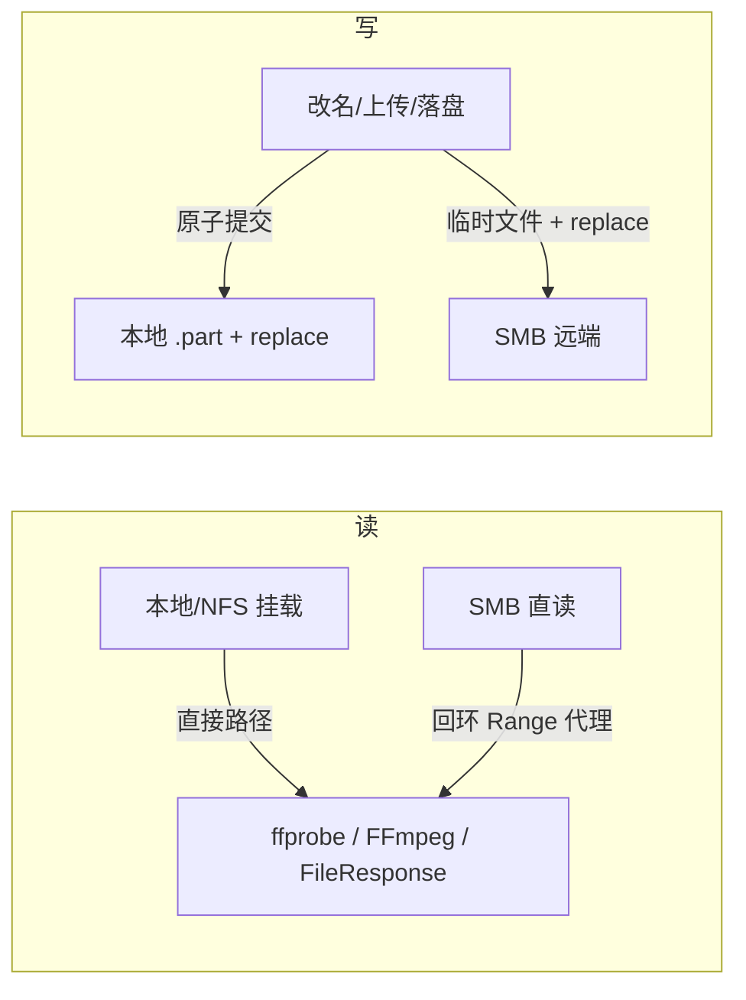

# 存储与文件操作设计

[开发者文档](README.md)

## 路径和范围

`media_libraries` 保存物理连接及媒体根，`libraries` 保存相对子目录和类型。业务读写通过 `library_paths` 找视频库，再向 `StorageBackend` 传**库内相对路径**。Compose 的 `MEDIA_HOST_PATH` 只是宿主挂载源，应用在容器里看到 `/media`；写死宿主绝对路径会破坏 NAS/容器部署。

`app/storage/base.py` 定义后端操作；`factory.py` 按库来源和 `SMB_DRIVER` 分流：本地/已挂载 NFS 使用本地后端，SMB 可直读或经挂载点。直读 SMB 的视频流通过只监听回环的内部 HTTP Range 代理交给 FFmpeg，而非假设 FFmpeg 自带 SMB 凭据。远程库离线或直读初始化失败时不能退到未挂载的空目录，否则清理工具会把“暂时不可读”误判为“文件已删除”。

媒体库根浏览使用只读伪库，进入具体视频库才开放该库内操作；跨视频库移动/复制不提供。后端必须验证目标仍在该库范围。媒体库只读、源文件缺失、目标被占、目录符号链接及 SMB 与本地的 rename 语义，需要在后端层统一处理，不能只依赖前端禁用按钮。

## 缓存与写操作

`app/storage/cache.py` 的短 TTL 元数据缓存减少 NAS 的 `stat/list` 往返；读句柄池减少 SMB Create/Close。写入、改名、删除要使自身及父目录的缓存失效，并逐出受影响的读句柄。扫描、缺失检查和维护入口需要明确“重新看盘”，不能把几秒旧缓存当最新事实。

### 复制、移动与上传

文件浏览复制通过后台任务递归执行，冲突生成“(副本)”并**绝不覆盖**。电影正片复制后用源片匹配提示登记为另一版本；目录复制和 TV 复制完成后需要扫描登记。移动/改名要更新库内文件路径及同茎附属资料，TV 分集保留 ID 与播放进度；媒体目录改名通过专门归档计划而非通用 fs 改名。

上传使用临时文件/原子落盘路径，重名或提交时目标并发出现返回 409，不覆盖。任何新文件写入路径都需复用后端的库范围、只读、冲突与路径校验，不应直接使用 `open()` 对 NAS 挂载路径落盘。

### 变更记录与扫描水位

成功发生的文件操作写入 `store/fs_changes.py` 的持久日志，部分成功同样保留。扫描开始记录变更水位；仅成功完整扫描清除已覆盖部分，失败、取消、离线和期间新增变更仍显示待扫描。复制任务取消后 `worker_finished=false` 仍表示后台可能写入，禁止同库扫描；快照过期时跳过 GC，避免删除仍有效的记录。

### 内容预览

文件内容读取走 `/api/fs/blob?library=<id>&path=<相对路径>`，必须精确指定视频库，不使用后端工厂的默认库兜底；支持只读库、本地与 SMB Range。文本预览只返回前 64 KiB；图片/PDF/视频内嵌有类型白名单，HTML/SVG 以文本或附件处理。预览不登记文件、不写扫描日志，已有媒体播放预览禁用进度及已看操作。

## 整理计划与审计

电影 `app/routers/files/planner.py` 生成预览，`executor.py` 处理确认执行。就地归档保留用户父目录；搬到顶层落本视频库根；目标占用和疑似错配不覆盖。

剧集 `app/scanner/tv_organize.py` 的 `plan_tv_organize` 先列动作/冲突，`execute_tv_organize` 执行并在 `organize_moves` 逐步记录，目录对象回写数据库时做前缀路径更新。撤销按批次反向时序计划并执行；原路径占用时跳过，不能用恢复逻辑强制覆盖。绝对集号需显式放行，做种保护另有守卫。测试中只使用临时目录，**开发过程不对真实媒体库运行 execute**。

## 故障界面

`/api/health` 查看 DB、库可读性及后端状态；具体 SMB 连接或挂载错误用媒体库 check/diag。任何新失败路径应带库 ID、相对路径和操作名记日志，同时避免输出密码、令牌及完整认证 URL。[API 与任务](api.md)。
