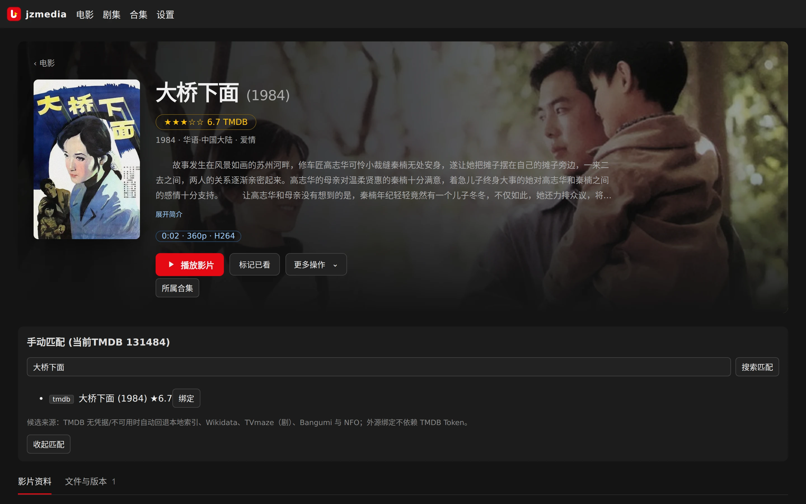
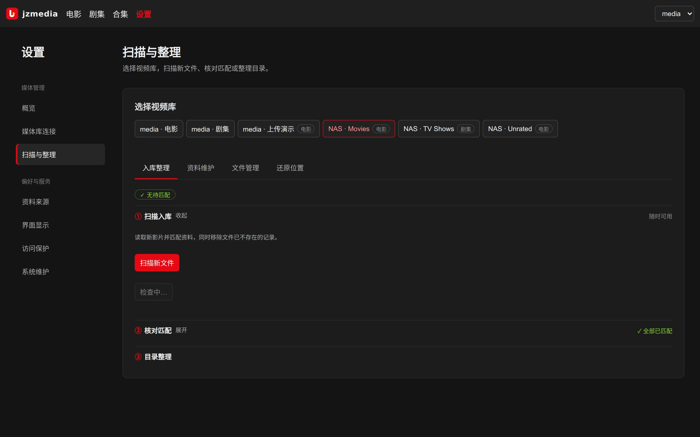
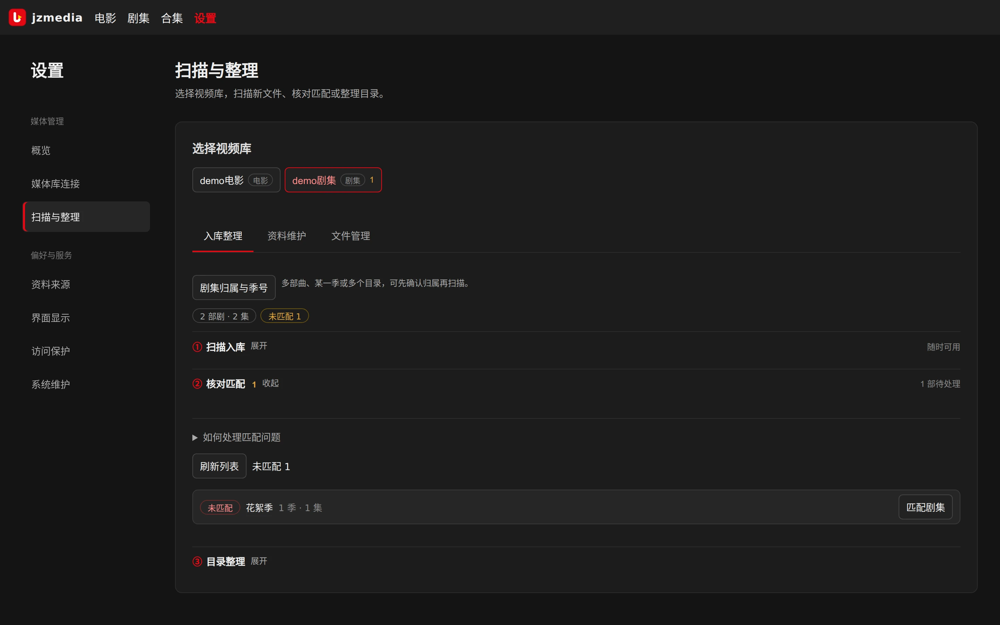

# 扫描与元数据

[用户手册](README.md)

扫描发现文件并更新库记录，匹配把文件关联到电影或剧集资料，落盘按视频库策略写 NFO 与图片，归档整理才移动或重命名。四件事入口不同，不要混为一谈。

## 案例一：一次顺利的入库

以电影 `大桥下面 (1984).mkv` 为例，文件放在某个电影视频库的 `大桥下面 (1984)/` 目录下：

1. 到「设置 → 扫描与整理」选择该电影视频库，在第 ① 步点「扫描新文件」。任务摘要显示新增 1 部，无需确认即完成匹配。
2. 海报墙出现《大桥下面 (1984)》，详情有简介、演职员与海报；媒体目录多出 `movie.nfo` 与 `poster.jpg`（取决于该库的落盘策略）。
3. 点播放验证能播。结束：不需要再做整理，文件名本来就是规范的。

能自动匹配是因为文件名带清晰标题与年份。短标题、重名作品、不同播出顺序仍要人工核对；即使年份接近，也可能只是标为待确认。

## 案例二：发现匹配错了

假设某部国产片被绑到了同名外国片上，症状是详情的简介、海报与实际内容对不上。按顺序做三件不同的事：

1. **纠正匹配**：详情「更多操作 → 重新匹配」，输入正确标题与年份，核对候选的海报、年份与来源后绑定。只改显示标题（「编辑资料」）修不好错配，必须换绑定。
2. **刷新资料**：换绑后点「更新资料」，按新绑定重取简介与图片，并按库策略重写 NFO/海报。
3. **写回文件**：若媒体目录里还是旧 NFO/海报，先看该库落盘策略与写权限，再用「更多操作 → 修复资料文件」，选只修 NFO、只修海报或两者。

*演示环境：输入正确标题后搜索，核对年份、海报与来源再点“绑定”；换绑不会移动文件。*

日常纠错顺序固定为：核对绑定 → 核对落盘设置及写权限 → 单片刷新/重写 → 最后才预览整理。不要靠改文件名掩盖错配。

## 入库整理的三个步骤

「设置 → 扫描与整理 → 对应视频库 → 入库整理」分三步，默认展开有待办的那一步：

1. **扫描入库**：读新影片并匹配资料，同时移除文件已不存在的记录。普通增量扫描复用已有匹配；来源规则变化才考虑强制重扫。取消只停止后续处理，已入库项保留。
2. **核对匹配**：处理未匹配、待确认、疑似英文、未归属花絮或集号问题。电影入口为详情「更多操作 → 重新匹配」，剧集入口在剧详情。
3. **目录整理**：预览原路径与目标路径，确认后才改名或移动。见[整理章节](organizing.md)。

*「扫描与整理」页：先选视频库，再按扫描→核对→整理推进；图为无待办的干净状态，有待办时对应步骤会自动展开。*

*演示环境：有待办时第 ② 步自动展开并显示徽标数，未匹配的剧可从行内直接进入匹配。*

## 来源链与离线资料

| 来源 | 用途 | 注意 |
|---|---|---|
| 本地索引/缓存 | 复用历史匹配、导入与来源资料 | 只覆盖已有信息 |
| NFO | 读媒体旁资料和本地图片，可离线入库 | 文件必须与媒体归属正确 |
| TMDB | 电影/剧集元数据与图片 | 需凭据和网络 |
| Wikidata | 无 key 外源及标识桥接 | 字段覆盖不保证完整 |
| TVmaze | 剧集及部分分集资料 | 分季/编号要和本地核对 |
| Bangumi (`bgm`) | 动漫等候选来源 | 建议配置 User-Agent，结果仍需核对 |
| IMDb 数据集 | 扩充离线标题、年份和 ID 索引 | 不等于完整海报/简介来源 |
| 豆瓣候选 | 默认关闭的可选提示源 | 不是完整豆瓣刮削/评分服务 |

在「设置 → 资料来源」页选择视频库、勾选匹配来源，点「保存匹配来源」。默认链为 local → tmdb → wikidata，按链顺序找候选，并非合并所有来源字段。连续失败的来源会冷却：展开运行状态看最近错误，修好网络后重置；正常空结果不算失败。没有 TMDB Token 仍可用 NFO、缓存和部分外源，但外源本身可能要联网。

「测试资料搜索」验证的是整条搜索路径，可能命中本地或备用来源，不能据此断定 TMDB 本身连通。

## NFO 与图片

电影 NFO 放在影片目录（`movie.nfo`）或与文件同名；剧集用剧根 `tvshow.nfo`、季目录 `season.nfo`、分集同名 `.nfo`。扫描可导入支持字段和本地图片，先用少量样本检查混放目录和多版本归属。

电影独占目录通常共用 `movie.nfo`、`poster.jpg`；同片多版本默认共用目录资料，只有 Plex 命名档且版本 edition 不同才补每版本资料。不同影片混放的目录按文件同名资料处理。`PER_VERSION_META=1` 可回退旧行为。图片缓存在数据目录 `posters/`，媒体目录落盘的是另一份；落盘开关是视频库的 `none/nfo/nfo_art` 策略，只读库不写盘。
