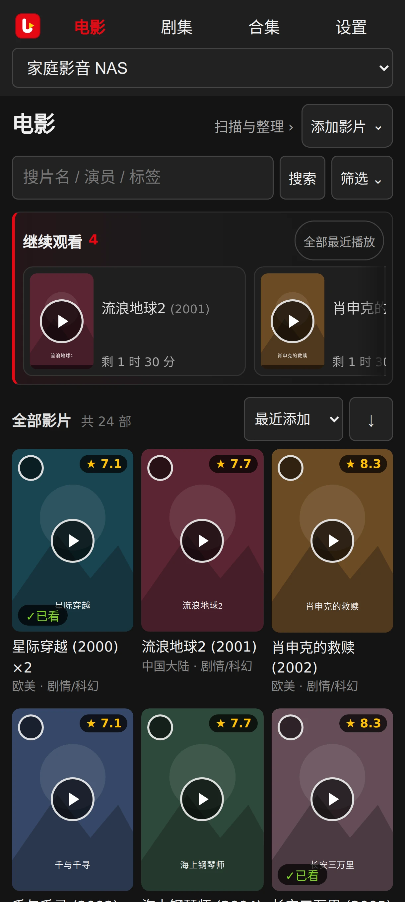

# 电影、合集与人物

[用户手册](README.md)

## 海报墙与筛选

入口：顶栏“电影”。先选媒体库，再搜索片名、原名、简介、演职员或标签等已入库文字。点击“筛选”展开条件，收起后仍显示已选摘要；排序与方向在海报墙上方选择。类型、产地大区、国家/地区、年代/年份、标签、已看状态、合集及 TMDB/豆瓣/自评分数可组合筛选。不同维度同时生效；多数维度内多选为任选其一，标签多选要求同时具备。计数来自当前库已有内容。筛选随 URL 保存，可分享链接；无结果时先清空筛选并确认媒体库。长列表会继续加载，也可点击“加载更多”。进入详情再返回时恢复已加载列表和原海报位置；滚动超过一屏后，右下角可一键回到顶部。浏览位置按当前媒体库、筛选与排序分别保存于本次会话。

*继续观看只在有有效断点时出现；墙默认按入库时间倒序，可切年份、评分等排序。*

*移动模拟（红米 K50 Ultra：407×904 CSS）：导航两行、继续观看与排序正常收窄，无横向溢出。*

## 添加影片

海报墙“添加影片”提供“扫描新文件”和“上传文件”。扫描前会显示目标电影视频库；有多个时先选择。上传仅允许当前媒体库中启用且可写的电影库，支持文件和文件夹，同名跳过、不覆盖。进度分别显示传输字节、已处理文件及成功／跳过／失败数；可取消传输并重试失败文件。已送达服务器的文件可能继续完成登记，取消后可扫描确认。上传完成后，归档整理仍须预览和确认。

## 详情和多版本

点击海报进入详情。首屏展示独立横版背景、评分、简介和播放入口；长简介可展开。“影片资料”展示演职员与“库中类似”，“文件与版本”集中下载、上传及文件管理；对应版本行的“更多 → 复制直链”可用于外部播放器。同片多个实际文件作为版本展示，先选择版本再播放；缺失或不可读文件会提示。可给版本填 edition、规格等备注；修改备注不自动改文件名。各文件维护独立断点。演员/导演可点进人物页，作品范围受当前媒体库限制；相似推荐来自本地库，不会替你下载其他影片。

同片两版本例子：`阿凡达 (2009).mp4` 与 `阿凡达 (2009)-V2.mp4` 在详情显示为版本 1、版本 2；看完版本 1 的一半退出，断点只记在版本 1 上，版本 2 仍从头开始。播放时先选版本，选错版本续播位置不对是正常的，切回正确版本即可。

*有断点时主按钮显示“继续观看”与上次位置；多版本在“文件与版本”中切换。*

## 手工资料与评分

在详情点击“更多操作 → 编辑资料”，修改简介覆盖、自评/豆瓣分、标签及版本备注并保存。“重新匹配”独立搜索和绑定候选，“更新资料”重新获取已绑定影片的资料，并按库策略重写 NFO／海报。已看状态在详情主操作中修改，合集在“所属合集”区域管理。分数范围 0～10；豆瓣分默认靠手工维护，不能把可选候选来源当成自动评分服务。标题错误如果是**匹配错片**，应先手动重新绑定，再核对 NFO/海报。刷新来源数据前可先检查单片，避免覆盖自己的调整。

## 海报与元数据

点详情海报可放大、下载或进入“换海报”候选界面。选中并保存后检查缓存图片；如果媒体目录里的 `poster.jpg` 仍旧，查看库的落盘策略、写权限和“更多操作 → 修复资料文件（可选 NFO、海报或两者）”。应用海报缓存与媒体目录海报是两份文件。

## 批量操作

从电影海报墙进入多选，勾选已加载电影，可批量标已看/未看、加/去标签、加入合集，或预览删除。**全选只选择当前已加载条目**。批量删除预览列影片、版本及文件数量，确认后会操作物理文件，不能当作“仅从列表隐藏”；执行前核对全部目标和备份。

## 合集

入口：顶栏“合集”、详情页“所属合集”或海报墙多选加入。在合集详情的“管理合集”中编辑名称、简介与成员；编辑时才显示“移出合集”。也可删除合集；删除合集不删除影片。详情中出现 TMDB 系列提示时可一键建系列合集。合集页默认展示“我的合集”；点击“新建合集”展开表单，推荐区域可展开，资料补全和全部重查收在“合集维护”。合集页会推荐库中同系列，忽略推荐只保存在当前浏览器；“补齐”将**已在库中的**同系列新片加到已有合集，不下载缺失影片。合集作用域是媒体库，可跨其下多个电影视频库。[手动匹配](metadata.md) · [整理归档](organizing.md)。
