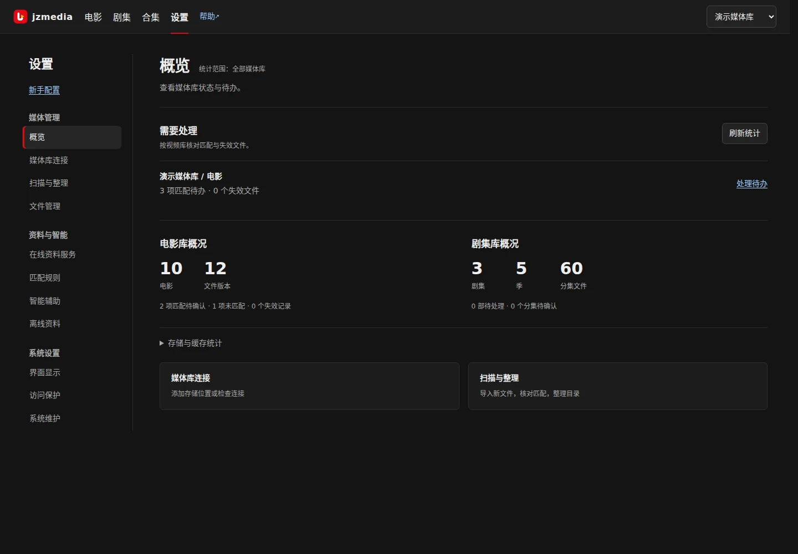

# 设置与维护

[用户手册](README.md)

## 设置页的范围

设置页按侧栏切换内容，一次只显示一个分区。桌面使用较宽的内容区，手机上可横向滚动分类导航。

*左侧一次一个分区：概览看统计与待办，媒体库连接管存储，扫描与整理按视频库工作，资料来源管匹配与凭据。*

| 分区 | 用途 |
| --- | --- |
| 概览 | 电影、剧集、季与分集文件统计，分视频库待办和存储占用 |
| 媒体库连接 | 添加存储位置、检查连接、管理电影库与剧集库 |
| 扫描与整理 | 选择视频库，进入入库整理、资料维护、文件管理或电影还原位置 |
| 资料来源 | TMDB 连接、匹配来源、来源状态、IMDb 离线数据 |
| 界面显示 | 当前浏览器的字体和海报大小 |
| 访问保护 | 设置或移除写操作令牌 |
| 系统维护 | 全局搜索索引重建与播放缓存清理 |

概览中的待办入口会定位到对应视频库。

| 设置项 | 作用范围 |
|---|---|
| 媒体库连接、视频库增删改 | 对应媒体库 / 视频库，全浏览器生效 |
| 资料来源凭据与匹配链、访问令牌、系统维护 | 全局，存数据库，全浏览器生效 |
| 扫描与整理各面板 | 当前选中的视频库 |
| 界面显示（字体、海报大小） | 当前浏览器，存 localStorage |
| 忽略的系列推荐 | 当前浏览器，存 localStorage |

“扫描与整理”每个视频库一个标签。入库整理分为扫描 → 核对匹配 → 目录整理，默认展开有待办的步骤。电影和剧集工具分别显示；详细说明按需展开。切换设置分区或视频库会保留已打开面板的表单和任务进度。电影/剧集详情页的原有链接仍会定位到对应视频库和工具。

## 资料来源与访问令牌

“资料来源 → TMDB 连接”输入 Read Token（优先于 API Key）、代理及语言，点“保存 TMDB 配置”。API Key、图片地址和配置来源在折叠区。密钥留空表示保留；清空代理等配置会恢复服务器环境配置或默认值。“恢复服务器配置”需再次确认。

“测试资料搜索”验证整条资料搜索路径，可能命中本地或备用来源，不能据此断定 TMDB 本身连通。匹配来源按视频库勾选，至少保留一个来源；“使用默认选择”只重置选择，需要保存才生效。连续失败的来源会暂停使用，可展开运行状态查看错误并允许重试。[来源说明](metadata.md)。

“IMDb 离线数据”也在资料来源页，默认收起。导入需要服务器可读的数据集路径；容器部署时要先挂载。任务有进度和取消入口。

“访问保护”配置可选令牌。保存新令牌后 `/api` 的写操作需令牌，浏览、播放和媒体直链仍开放。空输入不会关闭保护。“移除已保存令牌”会先显示确认：若服务器仍配置了令牌则恢复使用，否则关闭保护；由服务器直接提供的令牌需在服务器移除。它不提供用户账号、按库权限或完整公网访问控制。[部署配置](../getting-started/configuration.md)。

## 界面显示与系统维护

“界面显示”调整字体和海报大小，修改后自动保存到当前浏览器；海报越小，每行越多，可一键恢复默认。

“系统维护 → 搜索索引”用于修复搜索结果与资料不一致，不会下载元数据。“播放缓存”先检查可清理空间，再明确确认删除；作用于全部媒体库，跳过正在播放的会话。清理后再次播放可能需要重新缓存，海报和 NFO 不受影响。

## 电影视频库维护

入口：“设置 → 扫描与整理 → 电影视频库 → 资料维护”。除特别说明外，操作只作用于当前标签的视频库。普通扫描、匹配和单片刷新能解决的问题，不必先做整库维护。

| 操作 | 适用情况与实际影响 |
| --- | --- |
| 补全产地与人物 | 从现有 TMDB 缓存补齐缺失的产地及人物关联；不重新请求 TMDB，也不写 NFO。没有缓存的影片需先刷新来源。 |
| 从 TMDB 更新本库资料 | 逐部请求远端资料，处理当前视频库内已绑定 TMDB 的影片；执行数量受任务上限约束。会更新来源数据，手工标题保留。网络或代理有问题时先修复连接。 |
| 修复资料文件 | 选择仅 NFO、仅海报或两者。按当前资料与镜像缓存写入；远程库写入 NAS。修复海报／两者时有后台进度与取消入口，保留库的落盘策略。执行前确认目标和写权限。 |
| 移除蓝光碎片记录 | 移除误当电影入库的蓝光目录碎片**数据库记录**，保留物理文件。 |
| 移除样片与花絮误入库记录 | 移除样片/花絮被误当电影入库的**数据库记录**，保留物理文件。 |
| 清理挂载残留 | 仅对远程库显示；确认后删除**未挂载的本地挂载点**中历史误写的 NFO/图片。真正挂载中的 NAS 目录不参与。 |

清理项收在“清理误入库记录与挂载残留”，操作前会说明影响，再次确认后执行。详情页“修复资料文件”只针对当前影片，适合换绑后资料未落盘时先试。清理 BDMV/样片记录后再次扫描是否入库，取决于当前扫描识别规则和实际文件路径。

电影“还原位置”使用首次入库路径；“文件管理”可处理目录内文件。缩略图批量生成在维护面板内，生成范围为当前视频库。

## 剧集视频库维护

入口：“设置 → 扫描与整理 → 剧集视频库 → 资料维护”。“补全缺失剧集资料”补齐尚缺的剧/季/集资料；“重新获取全部剧集资料”重新取得已刮资料。两者更新数据库与 `data/posters`，不改视频文件或 NAS 目录。绝对集号映射可能仍需人工检查，尤其是特典、DVD 顺序或分季版本。

“预览写入清单”可先看重建剧集 NFO/海报的范围。执行后会向媒体目录写 `tvshow.nfo`、季 NFO；视频库选用“NFO+海报”模式时还会写海报及背景图，不会改名或移动视频。远程库默认不写逐集 NFO；启用 `TV_EPISODE_NFO=1` 会增加大量远程写入，请先评估库的规模。批量预览缩略图也是当前视频库范围。剧集整理和撤销在第三步，不由维护工具代替日常匹配。

## 任务进度与取消

扫描、预缓存、批量预览和若干维护项以后台任务显示进度。点取消是协作式停止后续工作，已成功的文件或记录通常保留。重启服务后部分进程内任务状态消失；重新进入页面先检查实际结果，再决定是否重跑。尽量避免在同一视频库并行执行扫描、强制重刮、整理和删除。
