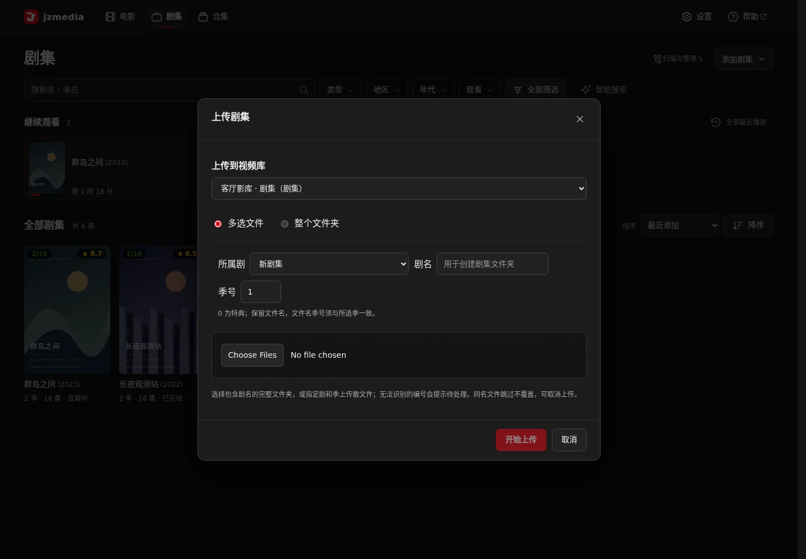
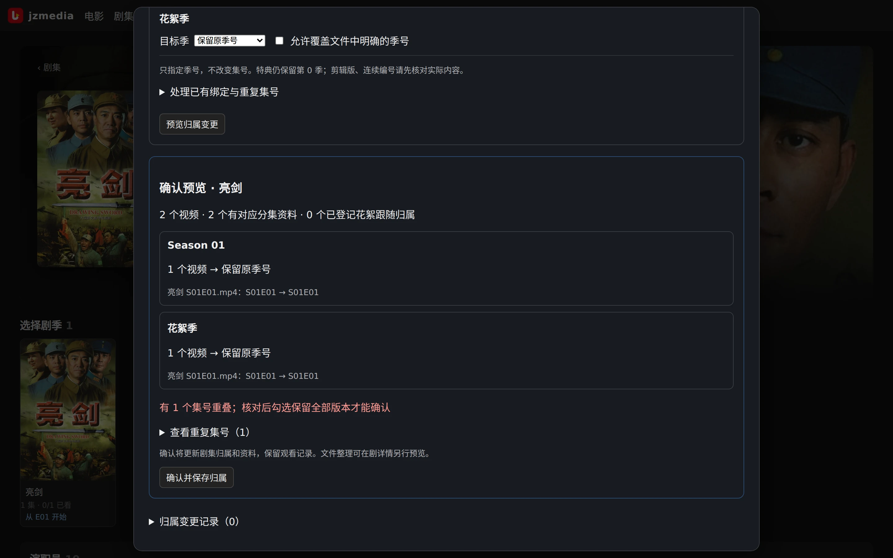

# 剧、季、集

[用户手册](README.md)

## 浏览和观看

在媒体库建立类型“剧集”的视频库并扫描。顶栏“剧集”汇总当前媒体库的剧集；搜索或筛选后点剧海报进入剧详情，再进入季和集。剧详情优先展示继续观看/下一集与选季，季详情优先展示选集，季/集也可标已看。剧、季、集沿用剧集横版背景，长简介按需展开；单集的上一集/下一集独立成行。各集保存独立断点；花絮和剧场版在剧详情的独立区块播放，拥有自己的断点。

*季页按集列出剧照与简介，“播放本季”从首集开始；断点与连播沿当前版本推进。*

多版本（V1/V2）集列表分组显示，连播优先沿当前版本走：V1E01 之后应找 V1E02，不把 V2E01 当下一集。季页可选择版本，去重集数包含多集文件覆盖的集号。上下集与自动连播统一使用服务端顺序，跨分页、跨季均保持当前版本，跳过已覆盖的集号；当前版本结束时自动连播停止。一个 `S01E01-E02` 文件仍是单个视频；Plex 的 `-partN` 表示分段文件，不等于第二版本。

## 添加剧集

剧集墙“添加剧集”提供“扫描新文件”和“上传文件”。两者都明确显示对应的剧集视频库；上传仅列出当前媒体库中启用且可写的目标。

默认上传整个文件夹，保留原目录结构。多选文件时需选择所属已有剧，或填写新剧名，并指定季号（0 为特典）；文件名的明确季号不能与选择冲突。文件传完后登记可识别的分集，再补全本次剧集资料，显示匹配结果。无法识别集号的文件保留在目标目录，并提示检查编号后重新扫描。上传不会自动移动或改名，目录整理仍经过预览与确认。

*传散集选“多选文件”，指定所属剧（或新剧名）与季号；整剧迁移用“整个文件夹”。*

长列表进入详情再返回会恢复海报位置，右下角“顶部”可快速回到开头。从剧、季、集详情切换媒体库时，会回到目标媒体库的剧集墙。

## 匹配整部剧

入口：剧详情“更多操作 → 重新匹配剧集”，或“设置 → 扫描与整理 → 剧集视频库 → 入库整理 → 核对匹配”。输入标题，核对年份、海报、来源与季集信息后选择候选。TMDB 候选可直接匹配；支持的无 TMDB ID 候选可“绑定外源”。已有待确认标记时核对后点“匹配正确”。“更多操作”中的“修改剧名”改变显示标题，“更新剧集资料”重新取当前绑定信息，两者均不等于移动本地文件。匹配后出现整理引导时，可先查看变更或取消。在“整理剧集目录”弹窗中，先核对原路径、新路径和目标季目录；“调整整理范围”默认收起，修改选项会自动更新预览。存在连续集号风险时，默认保留正片文件名；只有勾选“我已核对集号，允许按 TMDB 编号改名”才会重新预览文件名变化。点击“下一步：确认整理”，再次核对后点“确认并开始”。进度和完成结果留在弹窗中，整理历史可查看或撤销操作。

## 系列续作、多个目录与季号

同一系列的续作可能在资料来源中列为多个季，也可能有独立剧条目。先核对目标条目的季名、年份、集数和本地版本，再决定归属。不能仅凭同系列名称或集数相同自动合并。

入口：**设置 → 扫描与整理 → 剧集视频库 → 剧集归属与季号**，或剧详情 **更多操作 → 归属与季号**。尚未扫描的新目录也可直接选择。
弹窗会先显示数据库中已扫描的目录，再在后台刷新实体磁盘；远程 NAS 较慢或暂时不可达时，已扫描目录仍可立即核对。季资料建议、变更预览和保存也会转为后台任务并显示结果，浏览器请求超时不会重复启动同一项工作。

1. 勾选本次要处理的目录，搜索目标剧或点击“按目录获取建议”。候选会显示季名称、年份及集号覆盖的依据；获取建议不会直接改变归属。
2. 选择系列条目或已有剧，并逐目录指定季号。例如四部作品确认使用同一四季条目后，可以分别指定第 1–4 季；若采用独立剧条目，则分次选择各自目录和对应目标。
3. 点击预览，核对变更前后的季集号、资料缺失、重复集号及手工绑定冲突。文件里的明确季号与所选季冲突时，需要主动勾选覆盖；重复集号需要确认保留全部版本，文件不会被丢弃。
4. 确认保存。目录规则会持久保存，新增分集、重新扫描和资料刷新沿用确认结果。现有分集 ID、观看状态和播放进度保留。

两个目录指定不同季的例子：`第一季/` 与 `第二季/` 两个目录同属一部剧，分别指定第 1 季、第 2 季后预览，各自文件按原季号归位；若两个目录下都有 `S01E01`，预览会报集号重叠，必须勾选保留全部版本才能确认，两个文件成为同集的两个版本，谁也不丢。

“保留原季号”保留已入库分集的当前编号，新文件仍按文件名解析。特典保留第 0 季。确认后的目录按所选季集号补资料，找不到对应项时保留待确认，不再猜测跨季对应关系。

保存归属只修改应用中的归属记录和图片缓存，**不会移动视频、重命名或写入 NAS 的 NFO/海报**；只读媒体库也可使用。需要落盘资料时，使用剧集维护中的重建 NFO/海报。需要合并实际目录时，再打开“整理目录”预览确认：简单的独立季目录可归并到统一剧根的 `Season NN`；混合季号、目标占用或复杂层级会提示人工核对。首次归并保留正片名，完成后可再次预览统一命名。

*演示环境：两个目录指向同一剧的同一集时，预览标出集号重叠并要求先勾选保留全部版本；确认只改归属记录，不动文件。*

弹窗底部“归属变更历史”支持先预览再撤销，并保留撤销前的观看进度。若确认后又新增分集、移动目录或改变归属，旧记录不能直接撤销，需按当前状态重新设置归属。实体目录整理有自己的整理历史与撤销入口。

## 单集错配与本地集

进入集详情的“更多操作 → 修正集号匹配”，选季、查询该季候选，按实际内容核对后绑定。操作更新元数据关联，不自动改本地季/集号。总集篇、未收录特典等确实没有对应项，可填写本地标题并点“确认无对应集”；该集继续可播，不再反复作为待匹配提醒，整理时保持原名。以后找到匹配仍可手动绑定。绝对编号、DVD 顺序和特典顺序尤其不能只凭编号顺次套用。

## 花絮、存在性与落盘

剧详情把剧场版和花絮分区，是否归属正确取决于扫描识别和目录结构。远程文件若在应用外部移动，可使用剧或季详情中的“更多操作 → 检查文件是否可用”或重新扫描更新存在性记录；断线时先恢复连接，不要清理记录。

按库策略，剧根可写 `tvshow.nfo`/海报，季可写 `season.nfo`/季海报。远程库默认不批量写逐集 NFO；需要时在剧集维护任务中选择。目录规范化与审计撤销见 [整理章节](organizing.md)。
